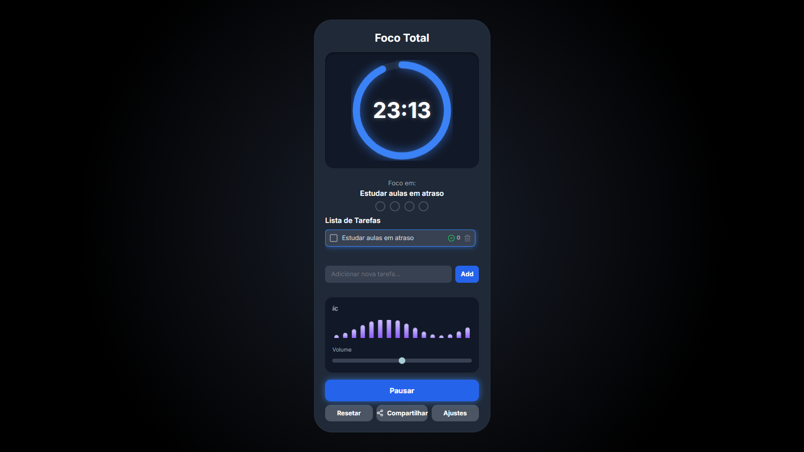

# 🍅 Foco Total - Seu Gerenciador Pomodoro Pessoal

Foco Total é uma aplicação web simples e elegante, baseada na técnica Pomodoro, desenvolvida para ajudar você a manter o foco e gerenciar suas tarefas de forma eficaz. Com uma interface intuitiva e design responsivo, ela permite que você configure seus ciclos de trabalho e pausas, adicione e acompanhe suas tarefas, e até ouça uma música ambiente para turbinar sua concentração.

## ✨ Recursos

* **Temporizador Pomodoro Personalizável**:
    * Defina durações customizadas para seus ciclos de foco, pausas curtas e pausas longas.
    * Ajuste o intervalo de Pomodoros para a pausa longa.
* **Gerenciamento de Tarefas Inteligente**:
    * Adicione, selecione e exclua tarefas com facilidade.
    * Marque tarefas como concluídas sem removê-las da lista.
    * Acompanhe o número de Pomodoros concluídos por tarefa.
* **Player de Música Integrado**:
    * Carregue vídeos ou playlists do YouTube para usar como música de fundo.
    * Controle de volume e visualizador de áudio que reage à música.
    * O player pode ser minimizado para não atrapalhar a interface.
* **Controle de Ciclos Visível**:
    * Veja o progresso do seu ciclo atual com um anel de progresso dinâmico.
    * Monitore o número de Pomodoros completados em seu ciclo atual através de indicadores visuais.
* **Notificações Sonoras**: Um breve som ao final de cada ciclo para alertar sobre a transição entre foco e pausa.
* **Compartilhamento Fácil**: Use o botão de compartilhamento para enviar o link da aplicação para amigos e colegas.
* **Design Responsivo**: Adapta-se a diferentes tamanhos de tela, proporcionando uma experiência consistente em desktops e dispositivos móveis.
* **Persistência de Dados**: Suas configurações, tarefas e até a última música tocada são salvas localmente no navegador.

## 🛠️ Tecnologias Utilizadas

* **HTML5**: Estrutura da aplicação.
* **CSS3 (Tailwind CSS)**: Estilização e responsividade, garantindo um visual moderno e limpo.
* **JavaScript (Vanilla JS)**: Lógica de funcionamento do temporizador, gerenciamento de tarefas e interatividade.
* **Web Audio API**: Para as notificações sonoras.
* **YouTube iFrame Player API**: Para integração e controle do player de música.
* **Lucide Icons**: Para ícones vetoriais limpos e consistentes.

## 🚀 Como Usar

1.  **Acesse a Aplicação**: Abra o arquivo `pomodoro_music.html` em seu navegador web.
2.  **Adicionar Tarefas**:
    * Digite o nome da sua tarefa no campo "Adicionar nova tarefa...".
    * Clique no botão "Add" ou pressione Enter.
3.  **Gerenciar Tarefas**:
    * **Selecionar**: Clique em uma tarefa na lista para selecioná-la para o foco.
    * **Concluir**: Clique no ícone de caixa de seleção (☐) para marcar uma tarefa como concluída (ela ficará riscada).
    * **Excluir**: Clique no ícone de lixeira (🗑️) ao lado de uma tarefa para removê-la.
4.  **Usar o Player de Música**:
    * Cole um link de vídeo ou playlist do YouTube no campo "Cole o link do YouTube aqui...".
    * Clique em "Carregar". A música começará a tocar.
    * Ajuste o volume com o controle deslizante.
5.  **Iniciar/Pausar o Foco**:
    * Clique em "Iniciar Foco" para começar o temporizador.
    * Clique em "Pausar" para interromper o temporizador.
6.  **Resetar e Ajustar**:
    * **Resetar**: Use o botão "Resetar" para reiniciar o temporizador no modo atual.
    * **Ajustes**: Clique em "Ajustes" para personalizar as durações dos ciclos.

## 💡 Dicas de Produtividade (Técnica Pomodoro)

* **Foco Ininterrupto**: Durante o ciclo de foco (geralmente 25 minutos), trabalhe exclusivamente na sua tarefa selecionada, evitando distrações.
* **Pausas Estratégicas**: Use as pausas curtas (5 minutos) para relaxar e se afastar do trabalho, e as pausas longas (15-30 minutos, após 4 ciclos de foco) para um descanso mais substancial.
* **Registro de Pomodoros**: O aplicativo ajuda a registrar quantos Pomodoros você dedicou a cada tarefa, auxiliando no acompanhamento do seu progresso.

## 🤝 Contribuição

Contribuições são bem-vindas! Sinta-se à vontade para abrir *issues* ou *pull requests* para melhorias, novas funcionalidades ou correção de bugs.

## 📄 Licença

Este projeto está licenciado sob a licença MIT. (Nota: O arquivo LICENSE não foi fornecido, esta é uma suposição comum para projetos open-source simples).
